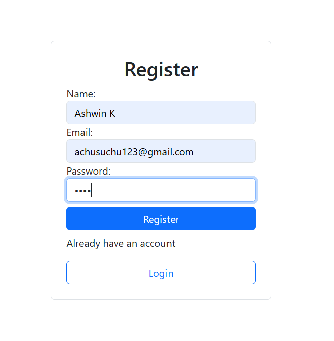

# 📦 Product Management Web Application

A full-stack web application designed to manage product records with secure authentication and seamless CRUD operations. This project focuses on simplicity, usability, and extendibility. Built using **React** for the frontend, **Node.js & Express** for the backend, and **MongoDB** as the database.

---

## 📸 UI Previews

### 📝 Register Screen


### 🔐 Login Screen


### 🏠 Home Page


### ➕ Add Product


### 🗑️ View & Delete Product


---

## ✨ Features

- 🔐 **Secure Login**  
  Users must log in using their credentials. Backend authentication is done using **JWT (JSON Web Tokens)**.

- 📋 **Product Listing**  
  View all added products in a structured layout with key details like name, price, and category.

- ➕ **Add Product**  
  Easily add new products with real-time validation to ensure data accuracy.

- ❌ **Delete Product**  
  Instantly delete a product from the list with a single click (no confirmation popup).

- ⚠️ **Error Handling**  
  Graceful error handling for login failures, invalid input, database issues, and more.

---

## 🔍 Descriptions

### 1. **Register Screen**
- Allows new users to create an account with required credentials.

### 2. **Login Screen**
- Clean and minimal form with `username` and `password` fields  
- Login button triggers backend authentication using JWT  
- Displays error messages for invalid credentials

### 3. **Home Page**
- Landing page after successful login  
- Displays a welcome message or relevant dashboard info

### 4. **Add Product Form**
- Fields: name, description, price, and category  
- Input validation for proper data types  
- Sends data to backend to be saved in MongoDB

### 5. **View & Delete Products**
- Shows a list of products with details  
- Each item has a delete button  
- Clicking delete instantly removes the product (no confirmation popup)  
- Displays success or error messages

---

## 🧪 Error Handling

- Invalid email or password during login  
- MongoDB connection issues  
- Validation for:
  - Numeric fields (price)
  - Required fields (e.g., name, category)
- Duplicate product prevention (if implemented)

---

## 🚧 Future Enhancements

1. Search and filtering capabilities  
2. Department-wise staff categorization  
3. Export functionality (Excel, PDF)  
4. Password encryption  
5. Multi-user support with roles  
6. Audit trail for changes  

---

## 🛠️ Setup Instructions

### Prerequisites

- Node.js and npm  
- MongoDB (local or Atlas)  
- Git

### Installation Steps

1. **Clone the repository**
   ```bash
   git clone https://github.com/your-username/product-management-app.git
   cd product-management-app
